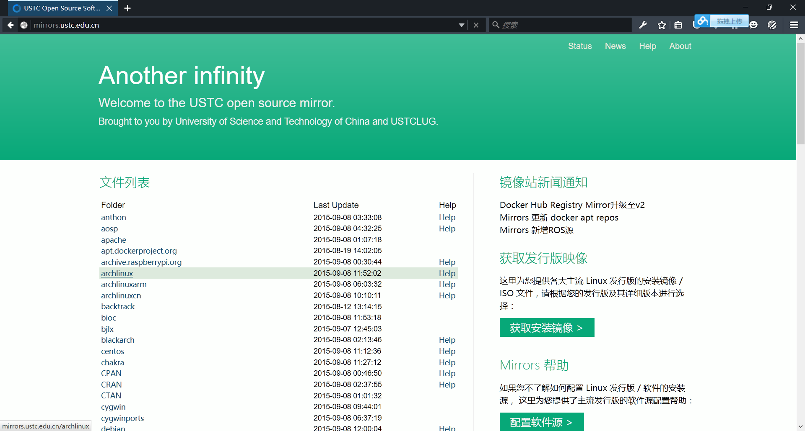
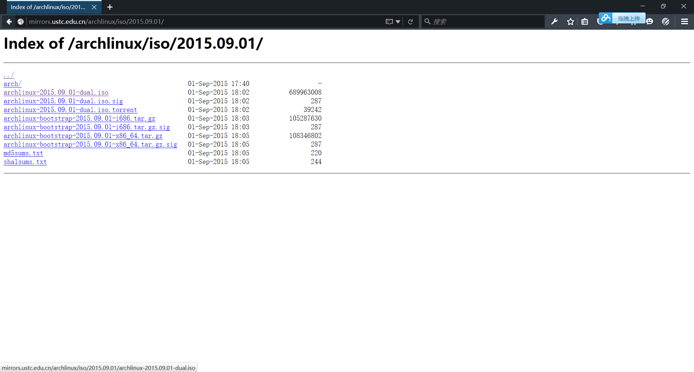
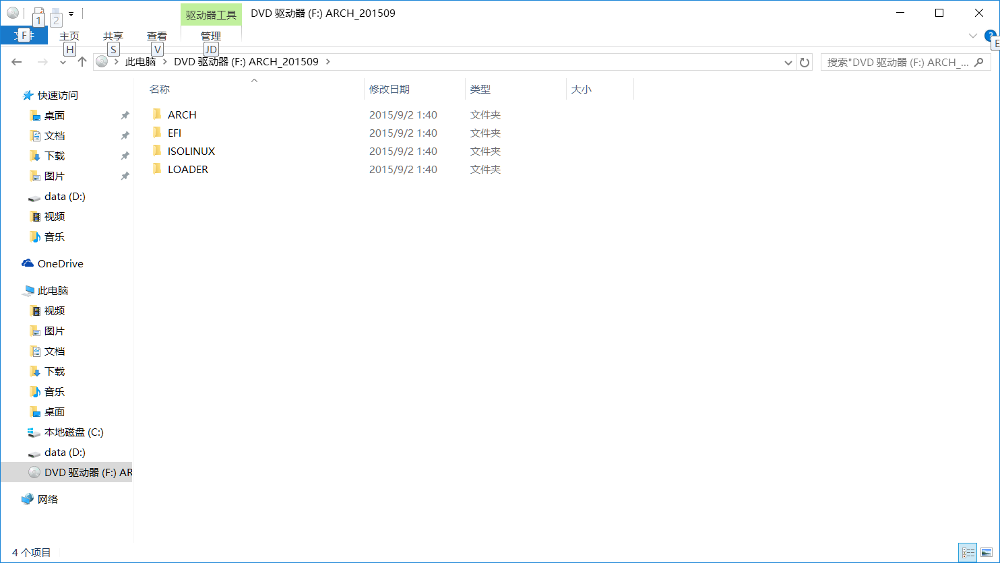
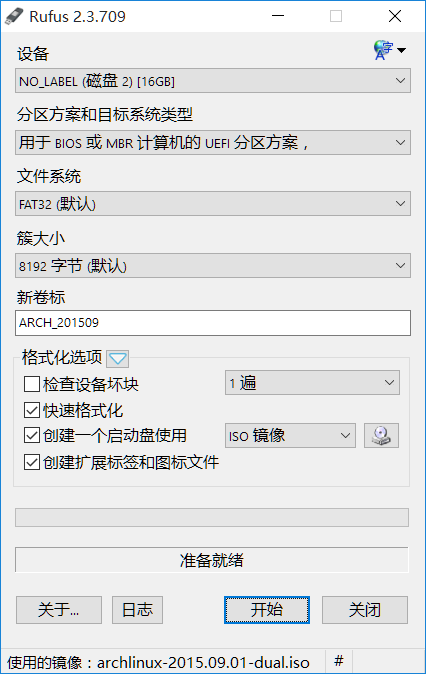
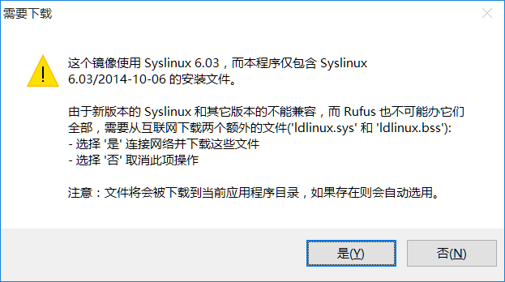
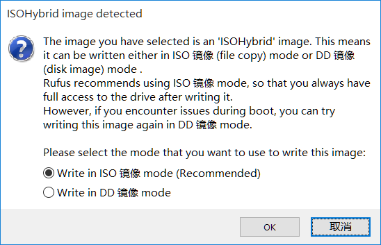
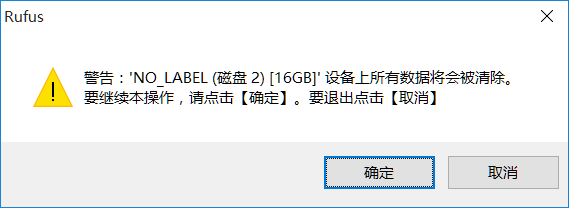

## 安装Arch Linux：一步一步了解Linux系统

现在，我们开始安装Linux系统。我们选用Arch Linux这个发行版，通过安装Arch Linux，可以帮助我们了解很多Linux的基本概念和构建Linux系统的方式。

在下文中，我们会在真实的机器上安装Arch Linux.对于对Linux不熟悉的读者，可以选择使用虚拟机安装，也可以买一块硬盘，在这块硬盘上安装(一块二手的320G硬盘的价格大约为140元)。总之，在安装前请先保证自己的数据不会丢失！

### 准备工作
首先，我们需要一个安装盘。

我们可以从Arch Linux的[官方网站](https://www.archlinux.org/)下载用于安装Arch Linux的iso镜像。而为了加速，世界上有很多开源社区建立了开源镜像站，里面提供很多发行版的iso镜像及软件源。下面我们从中科大的开源镜像站([http://mirrors.ustc.edu.cn/](http://mirrors.ustc.edu.cn/))下载Arch Linux的iso.在这里，我们下载2015.09版本的镜像，文件名为archlinux-2015.09.01-dual.iso.




下载了iso文件后，可以直接把这个文件刻录为光盘。现在很多的机器已经没有光驱了，因此我们要把它做成USB启动盘。以后我会讲解在Linux下制作启动盘的方法，考虑到很多人还在用Windows系统，因此接下来我们将要用[Rufus](https://rufus.akeo.ie/)制作启动盘。

首先下载Rufus.Rufus不需要安装，直接打开就能看到主界面。插入U盘之后，可以看到Rufus可以识别出U盘。Rufus有很多设置项，其中有一项叫“新卷标”，这一项要正确地填写，因为Arch的安装镜像启动时默认根据卷标判断启动所需文件的位置。我们可以先在Windows中挂载下载下来的iso文件，如果你所用的Windows版本没有虚拟光驱功能，可以安装[ImDisk](http://www.ltr-data.se/opencode.html/#ImDisk)后用它挂载iso.



可以看到，镜像的名字叫做`ARCH_201509`.接着，我们在Rufus的“新卷标”处填写`ARCH_201509`，分区方案选择“用于BIOS或MBR计算机的UEFI分区方案”(似乎翻译有问题，应该是用于BIOS和UEFI的MBR方案，大家可以回忆一下关于[系统固件](from-firmware-to-userspace.md#固件firmware)的内容。)，其他都用默认配置。然后在“创建一个启动盘使用”那里，右边有个光盘的图标，点击并选择下载下来的iso文件。最后点“开始”制作启动U盘。



接着Rufus会提示下载syslinux，选择“是”。



然后提示选择写盘模式，我们使用推荐的ISO模式。


最后有个格式化的警告，点击确定，即可格式化U盘并制作启动盘。


### 启动系统
制作好了安装盘之后，可以用这个安装盘启动系统了。启动之后，我们要先做一些安装前的准备工作。

#### 命令行工具的使用
启动之后，我们可以看到一个字符用户界面，有一个提示符，用户可以在上面输入命令，按下回车即可执行。对于没接触过Linux的用户，我们先学习一些常用命令行工具的使用。

* ls: 输入`ls`后回车，可以列出当前所在目录下的文件。Arch Linux的安装盘带有一个install.txt文件，执行ls后可以看到有这个文件。
* nano: 我们先学习一个简单的文本编辑器。执行`nano hello.txt`，在里面输入一些东西，然后按`Ctrl-X`，nano会提示是否保存修改，按y即可保存并退出。然后执行`ls`，看看目录下有什么文件？再执行一次`nano hello.txt`，看看刚才写的东西在不在里面？
* cat和less: 接着上面的的操作，执行`cat hello.txt`，可以发现，刚才往hello.txt写进去的东西都输出了出来。再执行`cat install.txt`看看是什么结果？再用`less install.txt`试试，可以使用上下键移动行，PgUp和PgDn翻页，也可以试试j,k,Ctrl-V,Alt-V这几个键，看完了之后按q键退出。

好了，学会了这几个命令之后，就可以列出当前目录下的文件，以及编辑和查看文件了。在之后的安装过程中，还会用到这些工具。

#### 配置网络
首先，我们执行`ip addr`，可以看到系统识别出的网卡。其中lo为一虚拟网卡，处理127.x.x.x这类特殊IP地址。以en开头的是有线网卡，以wl开头的是无线网卡。不同的网络环境下，配置网络的方式也不一样。下面讲解几种比较常用的网络的配置方法。假设所用有线网卡的名称为enp2s0,无线网卡为wlp4s0.

* 使用静态IP的有线网络: 假设要配置的IP地址为192.168.0.50,子网掩码为255.255.255.0(即最高24位均为1,后面为0),则执行`ip addr add 192.168.0.50/24 dev enp2s0`，并在`/etc/resolv.conf`中配置DNS服务器，如
```
# /etc/resolv.conf, DNS server is 192.168.0.1
nameserver 192.168.0.1
```
* 使用DHCP配置的有线网络: 执行`dhcpcd enp2s0`，没有看到错误提示，提示成功获得IP，则配置成功。
* 无线网络: Arch Linux的安装盘提供一个叫`wifi-menu`的工具，执行`wifi-menu`,选择要连接的无线热点，根据提示输入密码即可。

#### 选择镜像源
Arch Linux是通过网络进行安装的，为了以更快的速度下载软件包，建议先配置镜像源。配置镜像源的方法是编辑`/etc/pacman.d/mirrorlist`这个文件，将想用的镜像源的放到第一个非井号开头的行即可。如下可将中科大镜像源作为首选镜像源。
```
# /etc/pacman.d/mirrorlist
# This is the USTC mirror
Server = http://mirrors.ustc.edu.cn/archlinux/$repo/os/$arch

# and other mirrors
## Score: 4.6, China
Server = http://mirrors.163.com/archlinux/$repo/os/$arch
# ...
```

配置完成后可以执行`pacman -Syy`试一下，可以看一下pacman从镜像站下载文件的速度。

### 安装系统
进行准备工作之后，就可以装系统了。我们会把需要的文件(包括内核)安装至磁盘，随后安装引导加载器，这样就完成了一个可启动系统的安装。

#### 分区
为了把系统安装到硬盘上，我们需要对硬盘进行分区。如果对分区和文件系统的概念不了解的话，先学习一些基础知识吧。
* [分区和文件系统](fs-partition.md)

考虑到现在很多的机器都使用了UEFI固件和相应的启动方式，因此我们使用UEFI标准中推荐的GPT分区表。Linux下的GPT分区工具是gdisk.

为了方便，我们在这里分3个区，挂载点和功能如下：  
1. /boot: 我们把EFI系统分区挂载到/boot下，从而Arch Linux可以把内核安装在EFI系统分区中，便于一些引导加载器加载内核。一般来说，这个分区给200M就够了。  
2. /: 根文件系统，系统文件都放在这个分区中，我们给它分个50G，这样可以多装软件。事实上，对于不用大型应用的用户，10G就够了。  
3. /home: 存放用户文件用，硬盘上的剩余空间都放在这里。

对于内存小的机器，建议多分一个和内存大小相当的分区作为交换分区。在这里，为了方便，我们就不要这个分区了。

我们开始用gdisk分区。一般来说，对于只有一个硬盘的机器，硬盘为`/dev/sda`.于是我们执行`gdisk /dev/sda`.

在gdisk中，有一个提示符，输入命令后回车就能让gdisk执行相应操作。h命令可以查看gdisk的使用说明，p命令可以列出磁盘的分区状况。

我们现在把手上的硬盘重新分区，首先用o命令，它可以在硬盘上建立一个新的GPT分区表。

>
```
Command (? for help): o
This option deletes all partitions and creates a new protective MBR.
Proceed? (Y/N): Y
```

接着执行n命令，建立一个分区。按照如下方法，即可建立一个200M的，类型为'EFI System'的分区(用它作为EFI分区)，分区号为1.

> ```
> Command (? for help): n
> Partition number (1-128, default 1):
> First sector (34-10485726, default = 2048) or {+-}size{KMGTP}:
> Last sector (2048-10485726, default = 10485726) or {+-}size{KMGTP}: +200M
> Current type is 'Linux filesystem'
> Hex code or GUID (L to show codes, Enter = 8300): ef00
> Changed type of partition to 'EFI System'
> ```

执行p可以看到：

> ```
> Number  Start (sector)    End (sector)  Size       Code  Name
>    1            2048          411647   200.0 MiB   EF00  EFI System
> ```

同理可以建立我们想建的剩下两个分区，注意到提示'Hex code or GUID'时，我们使用默认的8300就行了，它表示的类型为'Linux filesystem'，这个是Linux系统的分区的默认类型。而'Last sector'那个提示用默认回答时，则表示使用硬盘后面的分区之前的所有空间(后面没有分区时则是用完所有的硬盘空间).

分区完成之后可以执行p看看效果，确认没有错误后执行w保存退出。

#### 格式化，挂载分区
分区是把硬盘分成了几个单独的部分，但是那些单独的分区需要一定的结构才能使用，因此需要格式化这些分区。我们一个一个分区地来吧。

首先是/dev/sda1.这个分区时EFI分区，按照标准，使用FAT32文件系统，我们执行`mkfs.vfat /dev/sda1`格式化。

接着是/dev/sda2.我们使用比较常用的ext4文件系统，执行`mkfs.ext4 /dev/sda2`格式化。

最后是/dev/sda3.我们使用xfs文件系统，和上面的方法类似，执行`mkfs.xfs /dev/sda3`即可。

格式化之后的分区就可以使用了。我们暂时把整个文件系统挂载在/mnt下，这样把文件放到/mnt下就可以把文件写入硬盘。在挂载的过程中，要注意按照挂载点的层次按顺序挂载，先挂载最顶层的/.
```
mount /dev/sda2 /mnt
```

接着挂载/boot和/home,注意要先建立目录才能挂载。
```
install -d /mnt/{boot,home}
mount /dev/sda1 /mnt/boot
mount /dev/sda3 /mnt/home
```

就这样，我们的硬盘的每个分区都挂载到了/mnt及其子目录下，往其中写文件就是往硬盘写文件。而且往/mnt/boot写入的文件都会写到/dev/sda1这个分区，往/mnt/home写入的文件都会写到/dev/sda3这个分区，往其他目录写入的文件都会写到/mnt/sda2这个分区，这就是分区和挂载点的对应关系。

#### 软件安装
安装Arch Linux的软件很简单，执行下面这条命令就行了：
```
pacstrap /mnt
```

考虑到不少用户需要使用无线上网功能，我们安装networkmanager：
```
pacstrap /mnt networkmanager
```

还有常用的开发工具最好也装上：
```
pacstrap /mnt base-devel
```

以上三类软件可以用一条命令进行安装(`pacstrap /mnt`相当于`pacstrap /mnt base`)：
```
pacstrap /mnt base base-devel networkmanager
```

#### chroot
做完了上面的工作之后，我们已经把Linux内核和需要的用户程序都安装到硬盘里面了。在安装bootloader之前，我们先了解一个叫做chroot的操作。

我们已经知道，文件系统是一个树形结构，它有一个根目录/,每个文件路径都可以从/一步一步走下去找到。而chroot的功能就是把一个进程(及其子进程)的根目录改为指定的路径，这样这个进程找一个文件时，便会从chroot指定的目录开始查找。

在这里，我们chroot到已经安装好的那个文件系统里面，这样就很容易对我们新安装的系统进行操作了。

一般来说，为了在进入新的文件系统后仍可以方便地操作内核，要挂载/proc,/dev,/sys到新的文件系统中。Arch的安装工具中提供了一个叫`arch-chroot`的脚本，它封装了这些操作，简化了chroot的过程。

现在我们执行`arch-chroot /mnt`，这样就以chroot的方式进入了新的系统。

#### bootloader
我们用的是UEFI的启动方式，对此我们使用gummiboot作为bootloader.gummiboot可以直接引导Linux内核，可以加载其他的EFI程序，从而可以引导其他系统，加载其他的bootloader或者执行一些特殊的EFI应用。

最新的systemd里面已经有一份gummiboot的安装程序，我们用它把gummiboot程序安装到EFI分区里面。

在chroot里面，执行`bootctl install`.接着可以看到安装过程的信息，bootctl程序把gummiboot安装到了/boot/EFI/Boot/BOOTX64.EFI并且添加了一条EFI启动项。

**注意: 有的UEFI实现支持添加EFI启动项，但是有的只支持默认路径efi/boot/bootx64.efi.因此bootctl在添加启动项的同时把文件安装到efi/boot/bootx64.efi是个稳妥的做法。**

接下来要配置gummiboot.我们创建并编辑/boot/loader/entries/archlinux.conf.
```
title Arch Linux
linux /vmlinuz-linux
initrd /initramfs-linux.img
options root=/dev/sda2 ro
```

它的意思是创建一个标题为Arch Linux的启动项，它用bootloader所在分区(/dev/sda1)根目录下的vmlinuz-linux作为Linux内核，initramfs-linux.img作为initramfs镜像(可以认为是一个临时rootfs镜像)，并且用`root=/dev/sda2 ro`作为内核参数。

再编辑/boot/loader/loader.conf.
```
timeout 3
default archlinux
```

意思是默认用archlinux.conf的配置启动，等待3秒没有键盘操作即使用默认配置启动。

#### 配置系统
现在系统启动需要的几个部件都装好了，剩下的是配置一下系统。

首先，我们要设置root密码，不然重启后就进不了系统了。在chroot环境下执行`passwd`,按要求输入两次密码即可。

然后是生成/etc/fstab文件，它的作用是指示init程序挂载分区到指定的挂载点。我们先执行exit或者按Ctrl-D退出chroot环境，然后执行`genfstab -U /mnt | tee /mnt/etc/fstab`,然后我们可以在终端上看到生成的fstab内容，并且这些内容已经写入/mnt/etc/fstab中了。

*tee的作用是在终端打印输入内容的同时写文件。这里用到了shell的管道(|符号)，它的作用是把|之前的命令的输出作为|后面命令的输入。*

*此外，genfstab的-U参数表示在fstab中用UUID表示分区。而之前在gummiboot配置中用/dev/sda2表示sda的第二个分区，是种比较简便的方法，但容易混乱。在多硬盘的情形下建议用UUID，内核命令行中可以写root=UUID=uuid-of-partition.*

### 重新启动
如果你一步一步地走到了这里，恭喜你，Arch Linux系统已经安装在你的机器上了。重新启动看看效果吧。

在退出了chroot环境之后，在终端下执行`reboot`命令，即可重新启动系统。然后，如果你看到了一个启动菜单，那就是gummiboot的界面，接着系统启动，最后出现一个登陆提示，说明你已经安装成功了！
